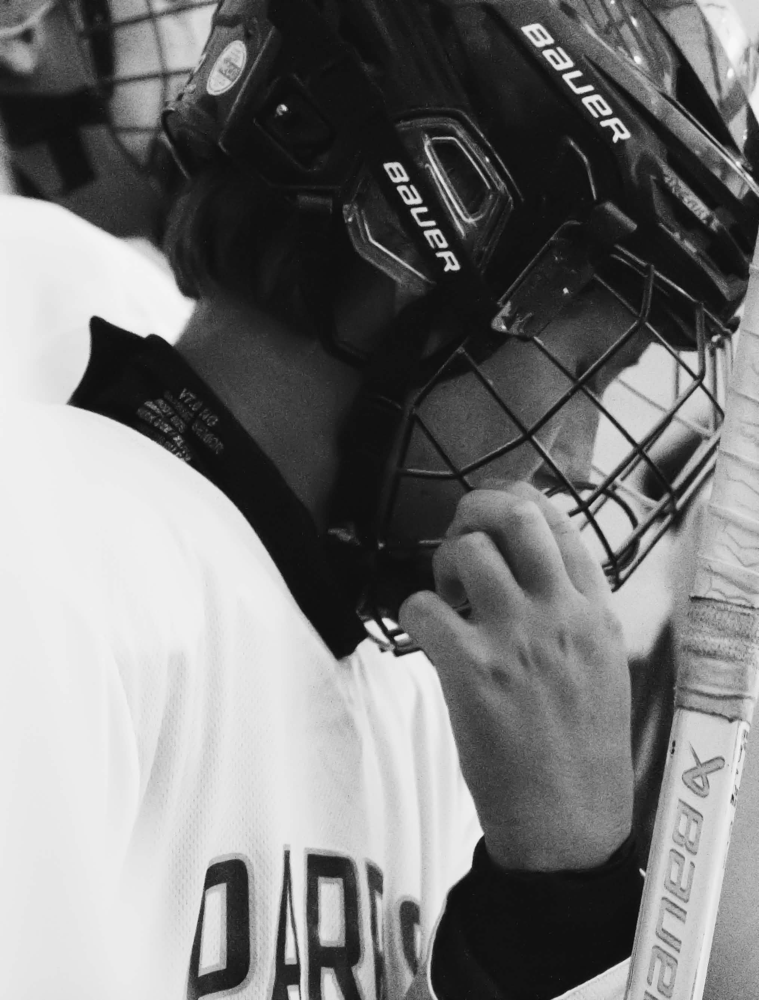

# Sports photography portfolio

A four-page static site. No build step, no framework, no dependencies — open
`index.html` in a browser and it works.

```
index.html      Home
work.html       Gallery with category filters
about.html      Bio, facts, clients
contact.html    Enquiry form
css/styles.css  Everything visual. Tokens are at the top.
js/site.js      Phone menu + gallery filtering
images/         Create this and put your photographs here
```

## 1. Fill in the placeholders

Every unknown fact is written in square brackets: `[Your Name]`, `[City,
Country]`, `[you@domain.com]`, `[Client one]`, `[Year]`. Search the four HTML
files for `[` and you'll find all of them.

The copy that isn't bracketed — the headline, the three "What I shoot"
paragraphs, the contact-page intro — is a starting point written to be
replaced. It should sound like you, not like a template.

## 2. Add the photographs

Create an `images/` folder. Each photo slot currently looks like this:

```html
<figure class="frame frame--tall">
  <!-- Replace with:  -->
  <div class="frame__ph">[Photo — vertical 2:3]</div>
</figure>
```

Delete the `<div class="frame__ph">` and the comment, drop the `` in its
place, and write real alt text describing the moment. The `frame--*` class sets
the aspect ratio, so the crop stays consistent whatever the file's dimensions:

| Class | Ratio | Used for |
| --- | --- | --- |
| `frame--tall` | 2:3 | Vertical |
| `frame--photo` | 4:5 | Gallery grid, portraits |
| `frame--square` | 1:1 | Square |
| `frame--wide` | 21:9 | Panoramic |

Export at roughly 2000px on the long edge, quality 80, and add
`loading="lazy"` to every image except the one at the top of the home page.
Sports files come off the card enormous; a 6MB hero will cost you visitors.

## 3. Wire up the form

`contact.html` has `action="[YOUR FORM ENDPOINT]"`. Two options that need no
server:

- **Netlify Forms** — if you host on Netlify, add `netlify` and
  `name="contact"` to the `<form>` tag and delete the `action`. Submissions
  appear in your Netlify dashboard.
- **Formspree** — sign up, create a form, paste the URL they give you into
  `action`.

Until you do one of these, the form will look right but go nowhere.

## 4. Change the look

The top of `css/styles.css` holds every colour and typeface:

```css
--accent: #C8341A;   /* the one hot colour: buttons, active nav, the dot */
--ink:    #131416;   /* text and the dark band */
--bg:     #FBFBFA;   /* gallery white */
```

Change `--accent` and it updates everywhere. The typefaces are Barlow Condensed
(headlines) and Spectral (body), loaded from Google Fonts in each page's
`<head>`.

## 5. Put it online

Drag the whole folder onto [netlify.com/drop](https://app.netlify.com/drop) —
it's live in about ten seconds on a temporary address, and you can point your
own domain at it from there. GitHub Pages, Cloudflare Pages and Vercel all work
the same way with a plain folder like this.

## Before you launch

- Replace every `[bracketed]` placeholder.
- Write real alt text on every image.
- Add a favicon and an Open Graph image, so links to the site preview properly.
- Check it on your phone, not just a narrow browser window.
